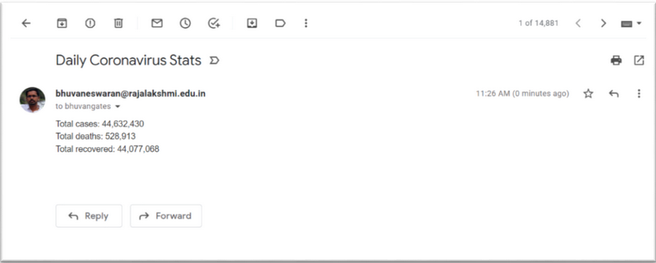

# Coronavirus Stat-Alert Bot

Worldometer is run by an international team of developers, researchers, and volunteers with
the goal of making world statistics available in a thought-provoking and time relevant format
to a wide audience around the world. It is published by a small and independent digital media
company based in the United States. We have no political, governmental, or corporate
affiliation. Furthermore, we have no investors, donors, grants, or backers of any type. We are
completely independent and self-financed through automated programmatic advertising sold
in real time on multiple ad exchanges.

**Problem Statement**
Build a Coronavirus stat-alert bot which scrapes Coronavirus stats (Total Cases, Total Deaths
and Total Recovered) from a user inputted country from this website
https://www.worldometers.info/coronavirus/ and sends an update email to your
friends/family with the scraped data.

**Challenge URL:**
https://www.worldometers.info/coronavirus/

**Sample Output**
